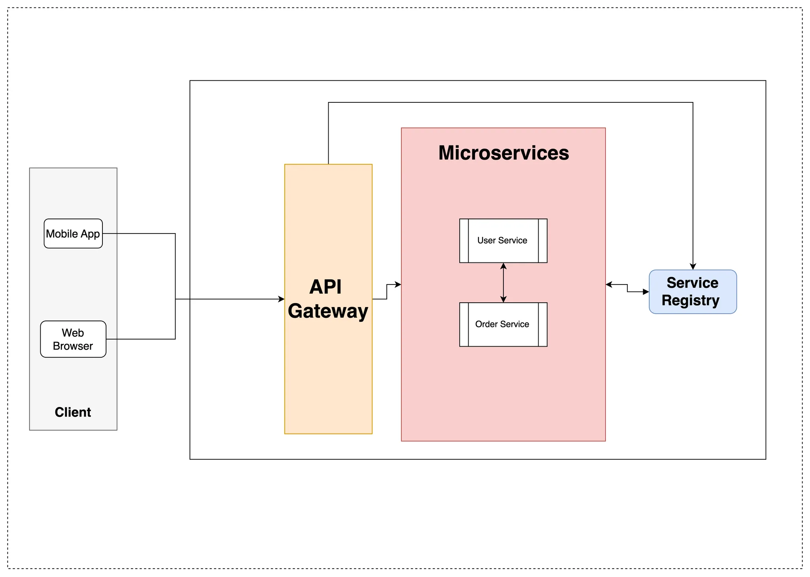

# **1. Overview**

This document outlines the implementation of a microservices architecture using **Spring Boot**, **Spring Cloud**, **Eureka Server**, and **Spring Cloud Gateway**. The services include:

- **UserService** (Handles user-related operations)
- **OrderService** (Handles order-related operations)
- **API Gateway** (Manages routing and security)
- **Registry Service (Eureka Server)** (Handles service discovery)

Github reference : https://github.com/Vipisanan/micro-service

## **2. Architecture Diagram**

---


```
 Client → API Gateway → {UserService, OrderService}
                      → Eureka Server (Service Discovery)
```

---

## **3. Service Implementations**

### **3.1 Eureka Server (Registry Service)**

This service acts as a **service registry** where all microservices register themselves.

### **Dependencies**

- Full dependency code

  https://github.com/Vipisanan/micro-service/blob/main/registry-service/pom.xml


```xml
<dependency>
    <groupId>org.springframework.cloud</groupId>
    <artifactId>spring-cloud-starter-netflix-eureka-server</artifactId>
</dependency>

```

### **Application Properties**

```
server.port=8761
eureka.client.register-with-eureka=false
eureka.client.fetch-registry=false
```

- Explanation
    - **`eureka.client.register-with-eureka=false`**: This prevents the service from registering with the Eureka server, meaning it won’t be discoverable by other services.
    - **`eureka.client.fetch-registry=false`**: This stops the service from fetching the list of other registered services from Eureka, meaning it won't automatically discover other services for communication.

  Both settings are useful when the service does not need to be discovered or interact with other services via Eureka.


### **Main Class**

```java
@EnableEurekaServer
@SpringBootApplication
public class EurekaServerApplication {
    public static void main(String[] args) {
        SpringApplication.run(EurekaServerApplication.class, args);
    }
}
```

---

### **3.2 API Gateway**

This service routes requests to the appropriate microservices dynamically.

### **Dependencies**

```xml
<dependency>
    <groupId>org.springframework.cloud</groupId>
    <artifactId>spring-cloud-starter-gateway</artifactId>
</dependency>
<dependency>
    <groupId>org.springframework.cloud</groupId>
    <artifactId>spring-cloud-starter-netflix-eureka-client</artifactId>
</dependency>

```

### **Application Properties**

```
server.port=8080
eureka.client.service-url.defaultZone=http://localhost:8761/eureka

spring.cloud.gateway.routes[0].id=user-service
spring.cloud.gateway.routes[0].uri=lb://USER-SERVICE
spring.cloud.gateway.routes[0].predicates[0]=Path=/users/**

spring.cloud.gateway.routes[1].id=order-service
spring.cloud.gateway.routes[1].uri=lb://ORDER-SERVICE
spring.cloud.gateway.routes[1].predicates[0]=Path=/orders/**
```

- Explanation
    - **`server.port=8080`**: Sets the port for the Spring Boot application to `8080`.
    - **`eureka.client.service-url.defaultZone=http://localhost:8761/eureka`**: Configures the Eureka client to register with the Eureka server running on `localhost:8761`.
    - **`spring.cloud.gateway.routes[...]`**: These are routes defined for Spring Cloud Gateway, which acts as a reverse proxy to route requests:
        - **`user-service` route**: Routes requests with the path `/users/**` to the `USER-SERVICE` registered in Eureka using load balancing (`lb://`).
        - **`order-service` route**: Routes requests with the path `/orders/**` to the `ORDER-SERVICE` registered in Eureka using load balancing.

  In summary, this configures a Spring Cloud Gateway to route incoming requests to the `USER-SERVICE` and `ORDER-SERVICE` via Eureka service discovery.


### **Main Class**

```java
@EnableEurekaClient
@SpringBootApplication
public class ApiGatewayApplication {
    public static void main(String[] args) {
        SpringApplication.run(ApiGatewayApplication.class, args);
    }
}
```

- **How API Gateway Works**

  An **API Gateway** acts as a **single entry point** to route requests to different microservices in a microservices architecture. It sits between the client (frontend or external consumers) and backend services, handling requests, load balancing, security, and other tasks like rate limiting, logging, and authentication.

  In a Spring Cloud environment, the **Spring Cloud Gateway** is typically used as an API Gateway to route requests to different microservices, and it integrates seamlessly with other Spring Cloud components like **Eureka** for service discovery.

  ### **How It Works:**

    1. **Routing Requests**:

       The API Gateway intercepts incoming requests and routes them to the appropriate backend microservices based on the URL or other parameters. The routes can be dynamically configured using `application.yml` or `Java config`.

    2. **Service Discovery**:

       Using **Eureka**, the API Gateway can automatically discover the services registered in the Eureka server. When a request comes in, the gateway knows which service to route to by querying Eureka.

    3. **Load Balancing**:

       The gateway can load balance requests across multiple instances of a microservice, ensuring better scalability and reliability.

    4. **Filters and Pre/Post Processing**:

       Spring Cloud Gateway allows you to define **filters** for custom processing of requests and responses (e.g., authentication, logging).


    ---
    
    ### **Dependencies in the `pom.xml`:**
    
    1. **Spring Cloud Gateway** (`spring-cloud-starter-gateway`):
        - Provides the functionality of routing requests to backend services and adding filters.
        - Includes features like dynamic routing, request/response filtering, and support for service discovery with Eureka.
    2. **Eureka Client** (`spring-cloud-starter-netflix-eureka-client`):
        - This enables the API Gateway to register with the **Eureka Server** and discover other services dynamically. It allows the gateway to route requests to services without hardcoding their locations.
    
    ### **Example `application.yml` Configuration:**
    
    ```yaml
    spring:
      cloud:
        gateway:
          routes:
            - id: order-service
              uri: lb://ORDER-SERVICE  # Load balancing using Eureka
              predicates:
                - Path=/orders/**
    
        discovery:
          enabled: true  # Enables service discovery with Eureka
    
    ```
    
    ### **Key Points**:
    
    - The **API Gateway** routes requests to backend microservices.
    - It uses **Eureka** to discover available services and enables **dynamic routing**.
    - You can configure custom filters for pre/post request handling.
    - **Load balancing** ensures that requests are distributed among available service instances.
    
    ### **Example Usage:**
    
    With the above configuration, when a client sends a request to `/orders/**`, the API Gateway will route it to the `ORDER-SERVICE`, discovered via Eureka.
    
    Would you like to see an example of creating custom filters or configuring specific routes?


---

### **3.3 UserService**

Handles user management operations.

### **Dependencies**

```xml
<dependency>
    <groupId>org.springframework.cloud</groupId>
    <artifactId>spring-cloud-starter-netflix-eureka-client</artifactId>
</dependency>

```

### **Application Properties**

```
server.port=8081
eureka.client.service-url.defaultZone=http://localhost:8761/eureka
eureka.instance.instance-id=${spring.application.name}:${server.port}
spring.application.name=USER-SERVICE

```

- **UserController Class**

    ```java
    @RestController
    @RequestMapping("/users")
    public class UserController {
    
    	  private final UserService userService;
    	  
        public UserController(UserService userService) {
            this.userService = userService;
        }
    
       @GetMapping("/getUsers")
        public ResponseEntity<List<UserDto>> getUsers() {
    
            return ResponseEntity
                    .ok()
                    .contentType(MediaType.APPLICATION_JSON)
                    .body(userService.getAllUsers());
        }
    
        @GetMapping("/getUsersWithOrders")
        public ResponseEntity<List<UserDto>> getUsersWithOrders() {
    
            return ResponseEntity
                    .ok()
                    .contentType(MediaType.APPLICATION_JSON)
                    .body(userService.getAllUsersWithOrders());
        }
    }
    ```


- **UserService Class**

    ```jsx
    @Service
    public class UserService {
        @Autowired
        private UserRepository userRepository;
    
        @Autowired
        private OrderInterface orderInterface;
    
        public List<UserDto> getAllUsers(){
           List<UserDao> usersDao =  userRepository.getAllUsers();
             return UserDto.from(usersDao);
        }
    
        public List<UserDto> getAllUsersWithOrders() {
            List<UserDto> usersDto =  UserDto.from(userRepository.getAllUsers());
            for(UserDto userDto: usersDto){
                userDto.setOrders(orderInterface.getOrdersByUserId(userDto.getUserId()).getBody());
            }
            return usersDto;
        }
    }
    ```


### **OrderInterface (Feign Client)**

The `OrderInterface` is a **Feign Client** used to interact with the `ORDER-SERVICE` microservice. It defines a method `getOrdersByUserId` to fetch orders for a given user using an HTTP GET request.

- **Feign OrderInterface Class**

    ```jsx
    package com.vp.user_service.feign;
    
    import com.vp.user_service.dto.OrderDto;
    import org.springframework.cloud.openfeign.FeignClient;
    import org.springframework.http.ResponseEntity;
    import org.springframework.web.bind.annotation.GetMapping;
    import org.springframework.web.bind.annotation.PathVariable;
    
    import java.util.List;
    
    @FeignClient("ORDER-SERVICE")
    public interface OrderInterface {
        @GetMapping("/order/{userId}")
        public ResponseEntity<List<OrderDto>> getOrdersByUserId(@PathVariable int userId);
    }
    
    ```


### **Why Use It?**

- **Simplifies service-to-service communication**.
- Automatically sends HTTP requests to `ORDER-SERVICE` without manually coding HTTP logic.
- **Declarative approach** to interacting with other services.

### **How It Connects**:

- **`@FeignClient("ORDER-SERVICE")`** connects to the service registered as `ORDER-SERVICE` in Eureka.
- **Autowire** the interface in your class to use its methods for service communication.

---

### **3.4 OrderService**

Handles order management operations.

### **Dependencies**

```xml
<dependency>
    <groupId>org.springframework.cloud</groupId>
    <artifactId>spring-cloud-starter-netflix-eureka-client</artifactId>
</dependency>

```

### **Application Properties**

```
server.port=8082
eureka.client.service-url.defaultZone=http://localhost:8761/eureka
eureka.instance.instance-id=${spring.application.name}:${server.port}
spring.application.name=ORDER-SERVICE

```

### **OrderController**

```java
@RestController
@RequestMapping("/order")
@AllArgsConstructor
public class OrderController {

    private final OrderService orderService;

    @GetMapping({"/{userId}"})
    public ResponseEntity<List<OrderDto>> getOrdersByUserId(@PathVariable int userId) {
        return ResponseEntity
                .ok()
                .contentType(MediaType.APPLICATION_JSON)
                .body(orderService.getOrderByUserId(userId));
    }

}
```

---

## **4. Running the Microservices**

1. **Start Eureka Server** (`EurekaServerApplication` on port 8761)
2. **Start API Gateway** (`ApiGatewayApplication` on port 8080)
3. **Start UserService** (`UserServiceApplication` on port 8081)
4. **Start OrderService** (`OrderServiceApplication` on port 8082)

After starting all services, visit:

- **Eureka Dashboard:** `http://localhost:8761`
- **UserService via API Gateway:** `http://localhost:8080/users/status`
- **OrderService via API Gateway:** `http://localhost:8080/orders/status`

---

## **5. Conclusion**

This document provides a basic implementation of a microservices architecture using **Spring Boot**, **Spring Cloud**, **Eureka**, and **Spring Cloud Gateway**. This architecture allows services to be independently scalable, resilient, and easy to manage. Further enhancements can include authentication, database integration, and Kubernetes deployment.